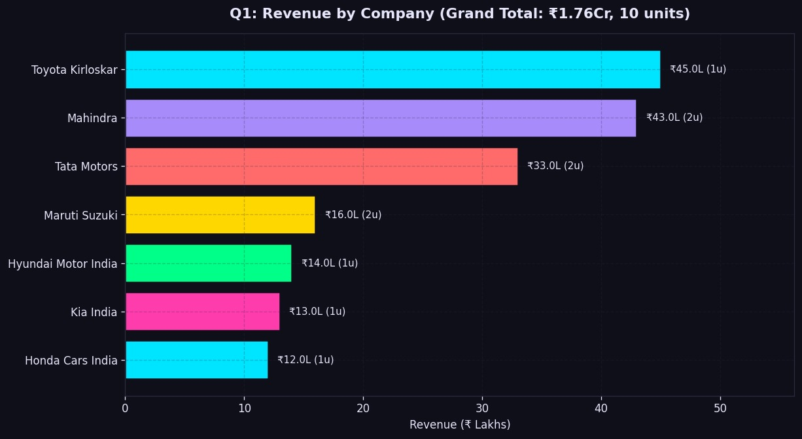
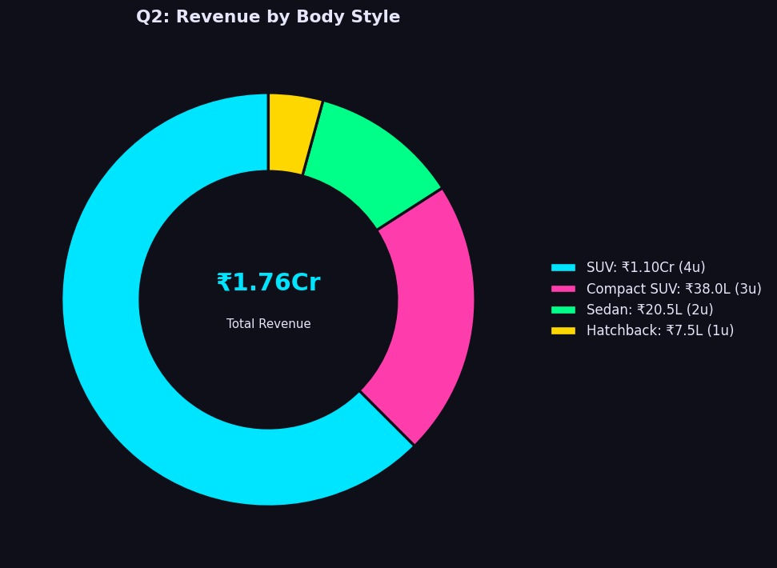
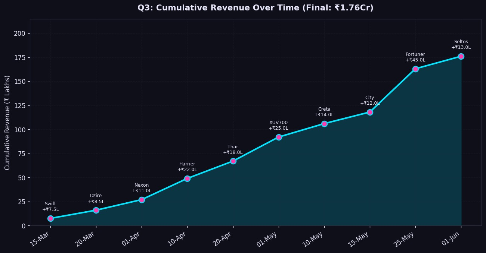
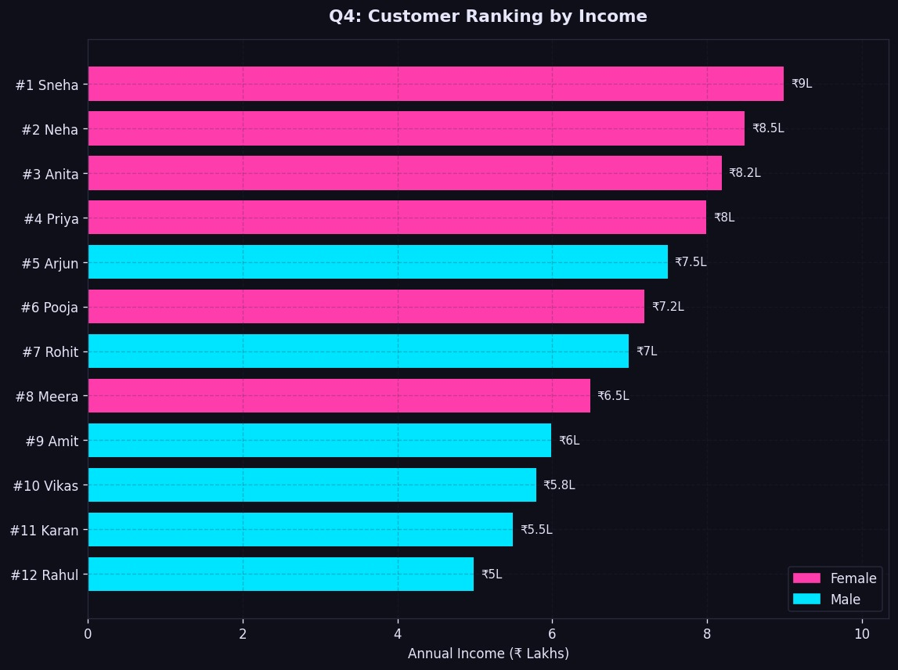
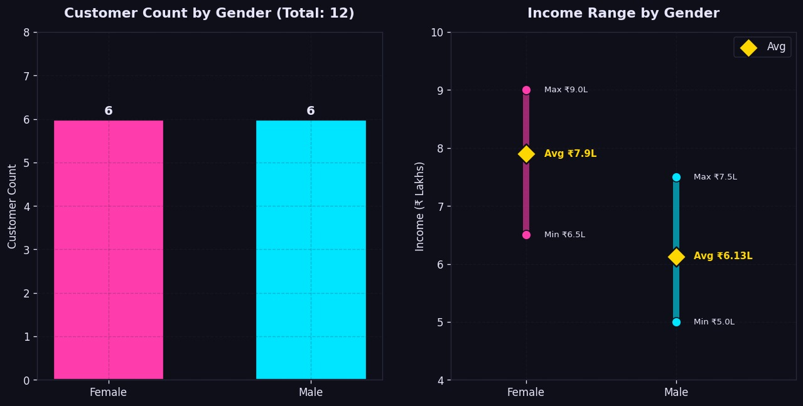
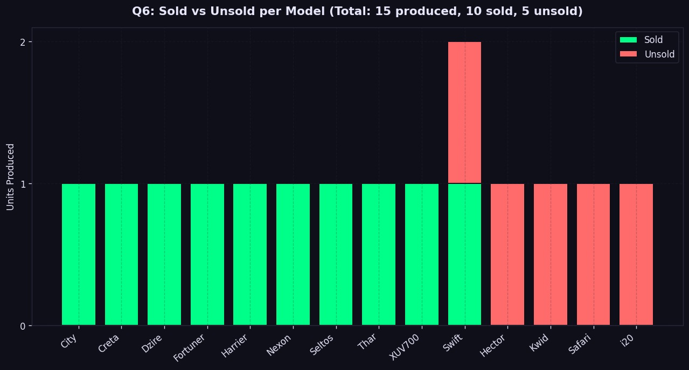
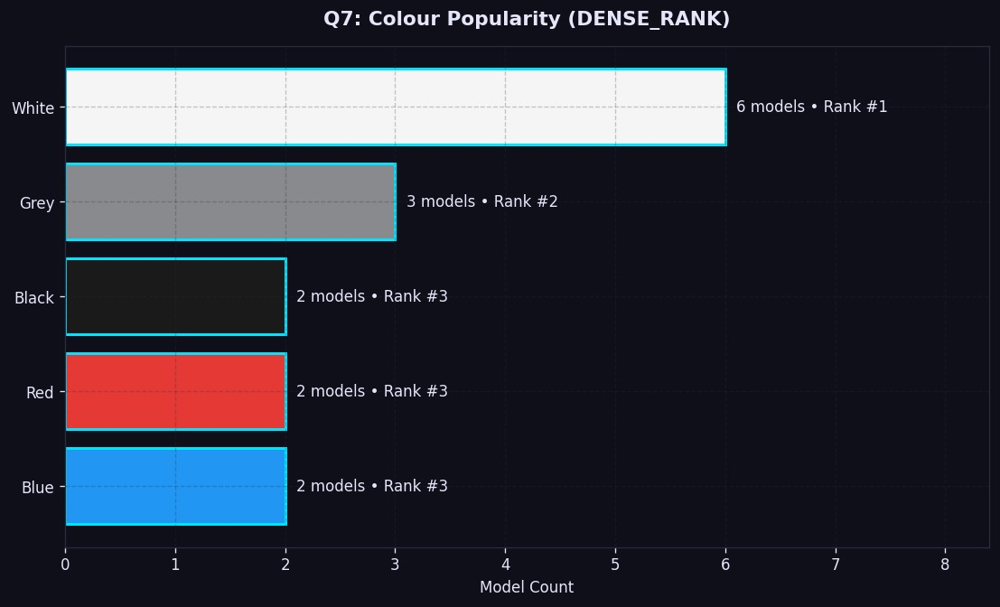
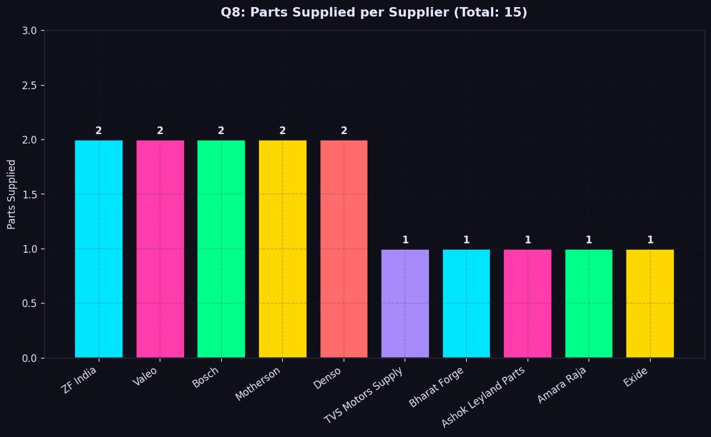
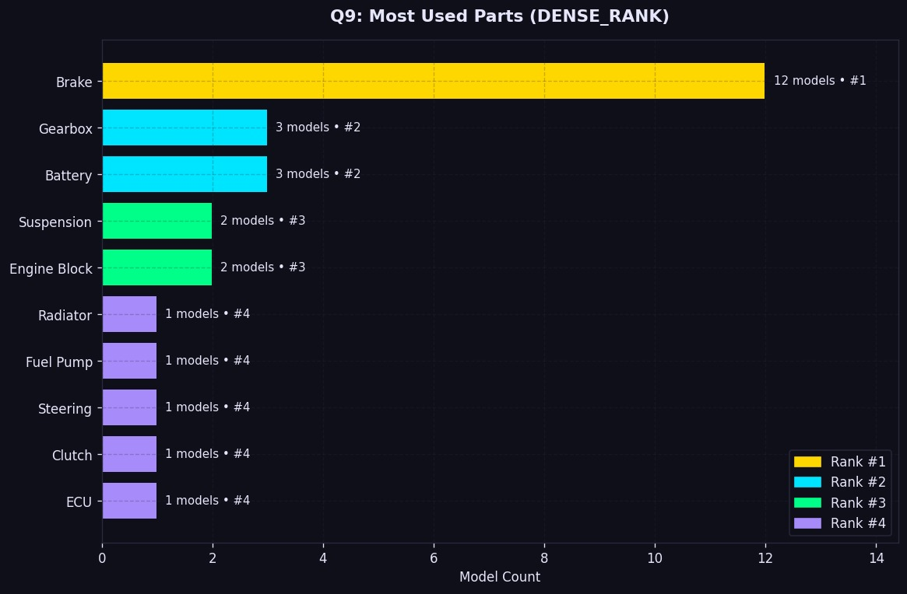
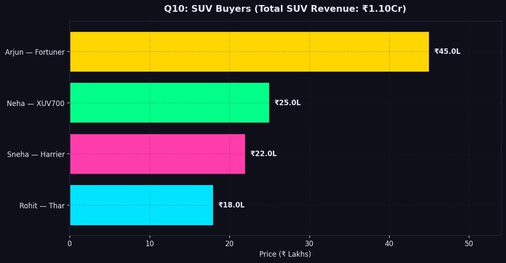

# Indian Automobile Enterprise Database — Oracle SQL

> A fully normalized 19-table relational database modeling the complete Indian automobile manufacturing ecosystem — from company hierarchy and vehicle configuration to dealership sales pipeline and supply chain traceability.

## ER Diagram


## Database Architecture

The schema models a real-world automobile enterprise across 6 dependency layers:

| Layer | Tables | Purpose |
|-------|--------|---------|
| **Foundation** | Company, Colours, Engine, Transmission, Bodystyle, Supplier, Parts, Plant | Independent reference entities |
| **Hierarchy** | Brand, Model, Dealer, Customer, Serializing_Part | Depend on foundation tables |
| **Configuration** | Model_Colour, Model_Engine, Model_Transmission, Model_Parts | Junction tables with composite keys for valid vehicle configurations |
| **Inventory** | Vehicle | Composite foreign keys ensuring only valid colour/engine/transmission combos per model |
| **Sales** | Sold_Vehicle | Tracks customer purchases with VIN uniqueness constraint |

### Key Design Decisions

**Company → Brand → Model hierarchy:** Reflects how Indian auto companies operate (e.g., Tata Motors → Tata → Nexon, Harrier, Safari).

**Body style as a Model attribute, not a junction table:** A Swift is always a Hatchback, a Fortuner is always an SUV. Body style is fixed per model, not a customer choice like colour or engine — so it's a direct FK in the Model table, not a many-to-many relationship.

**Composite foreign keys in Vehicle:** The Vehicle table references `(model_id, colour_id)`, `(model_id, engine_id)`, and `(model_id, transmission_id)` — ensuring a vehicle can only be configured with options that actually exist for that model. You can't accidentally assign a diesel engine to a model that only comes in petrol.

**Serializing_Part with VIN tracing:** Every serialized part links back to the specific vehicle it was installed in, enabling full supply chain traceability from supplier → batch → vehicle.

## Indian Brands Covered

| Company | Brands | Models |
|---------|--------|--------|
| Tata Motors | Tata | Nexon, Harrier, Safari |
| Mahindra | Mahindra | Thar, XUV700 |
| Maruti Suzuki | Maruti | Swift, Dzire |
| Hyundai Motor India | Hyundai | Creta, i20 |
| Toyota Kirloskar | Toyota | Fortuner |
| Honda Cars India | Honda | City |
| Kia India | Kia | Seltos |
| MG Motor India | MG | Hector |
| Renault India | Renault | Kwid |

## OLAP Analytics (10 Queries)

Advanced SQL queries using ROLLUP, RANK, DENSE_RANK, and window functions:

| # | Query | SQL Feature | Key Finding |
|---|-------|-------------|-------------|
| 1 | Revenue by Company | ROLLUP | Toyota Kirloskar leads at ₹45L (1 unit — Fortuner) |
| 2 | Revenue by Body Style | ROLLUP | SUVs dominate with ₹1.10Cr (63% of total revenue) |
| 3 | Cumulative Revenue Over Time | Window SUM | Revenue accelerates in May with premium SUV sales |
| 4 | Customer Income Ranking | RANK | Top 4 earners are all female customers |
| 5 | Gender Analysis | ROLLUP + AGG | Female customers earn ₹7.9L avg vs ₹6.13L for males |
| 6 | Sold vs Unsold Inventory | LEFT JOIN + ROLLUP | 10 of 15 vehicles sold (67% sell-through rate) |
| 7 | Colour Popularity | DENSE_RANK | White dominates with 6 vehicles (40% of inventory) |
| 8 | Parts per Supplier | ROLLUP | Top 5 suppliers each supply 2 parts; 5 supply 1 each |
| 9 | Most Used Parts | DENSE_RANK | Brake is universal (12 models); Gearbox and Battery tied at rank #2 |
| 10 | SUV Buyer Profile | Multi-JOIN | 4 SUV buyers spent ₹1.10Cr total, avg ₹27.5L per vehicle |

## Visualizations

All 10 queries visualized with a dark neon theme using Python matplotlib:

### Revenue by Company


### Revenue by Body Style


### Cumulative Revenue Over Time


### Customer Income Ranking


### Gender Analysis


### Sold vs Unsold Inventory


### Colour Popularity


### Parts per Supplier


### Most Used Parts


### SUV Buyers


## Project Structure

```
automobile-enterprise-db/
├── README.md
├── sql/
│   ├── 01_schema.sql          # 19 CREATE TABLE statements with constraints
│   ├── 02_inserts.sql         # Sample data for all tables
│   └── 03_olap_queries.sql    # 10 analytical queries
├── visualizations/
│   ├── olap_charts.py         # Python matplotlib script (dark neon theme)
│   ├── q1_revenue_by_company.jpeg
│   ├── q2_revenue_by_bodystyle.jpeg
│   ├── q3_cumulative_revenue.jpeg
│   ├── q4_customer_income_rank.jpeg
│   ├── q5_gender_analysis.jpeg
│   ├── q6_sold_vs_unsold.jpeg
│   ├── q7_colour_popularity.jpeg
│   ├── q8_parts_per_supplier.jpeg
│   ├── q9_most_used_parts.jpeg
│   └── q10_suv_buyers.jpeg
├── docs/
│   ├── erd_diagram.jpeg       # Hand-drawn Entity-Relationship Diagram
│   └── query_outputs.txt      # Raw SQL*Plus output for all 10 queries
└── requirements.txt
```

## Tech Stack

**Database:** Oracle SQL (SQL Developer)
**SQL Features:** DDL, DML, CHECK constraints, composite foreign keys, ROLLUP, RANK, DENSE_RANK, window functions, LEFT JOIN aggregation
**Visualization:** Python 3, matplotlib, numpy

## How to Run

### Database Setup
1. Open Oracle SQL Developer
2. Run `sql/01_schema.sql` to create all 19 tables
3. Run `sql/02_inserts.sql` to populate sample data
4. Run `sql/03_olap_queries.sql` to execute analytics

### Visualizations
```bash
pip install matplotlib numpy
python visualizations/olap_charts.py
```

## Author

**Harsh Palyekar** — B.Sc. Data Science, Goa University
[LinkedIn](https://www.linkedin.com/in/harsh-palyekar-790209295) · [GitHub](https://github.com/harsh241005)
